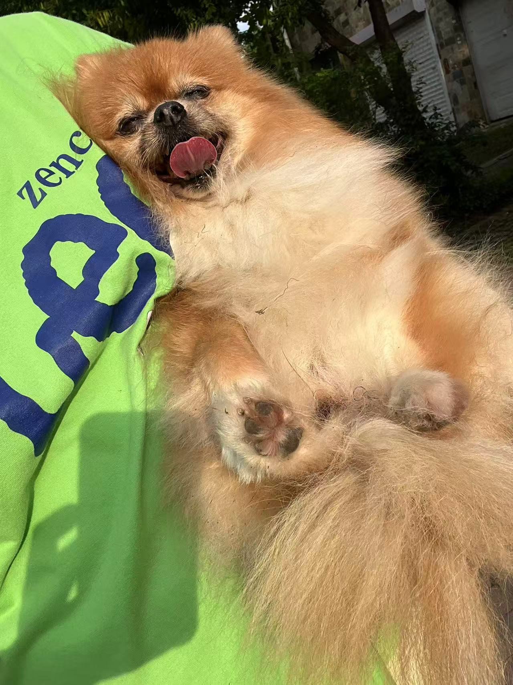

Hi, I'm **Yuwei** 👋  
Welcome to my personal website! I'm a **biostatistics student** interested in **data science**.

- 🏠 This is the [home page](index.html).  
- 🎓 Check out my [academic and professional experience](experience.html).  
- 📊 View some [plots and visualizations](plots.html).  
- ℹ️ Learn more [about this site](about.html).

---

Here's a picture of Granny (I don't have either a cat or dog so I borrowed my friends Niki's dog Granny):

{width=50%}
